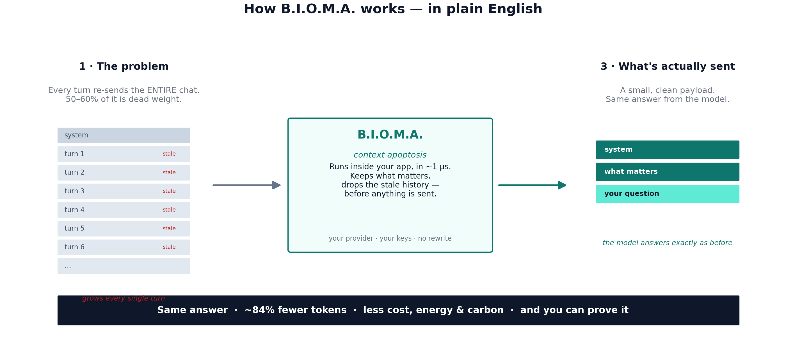
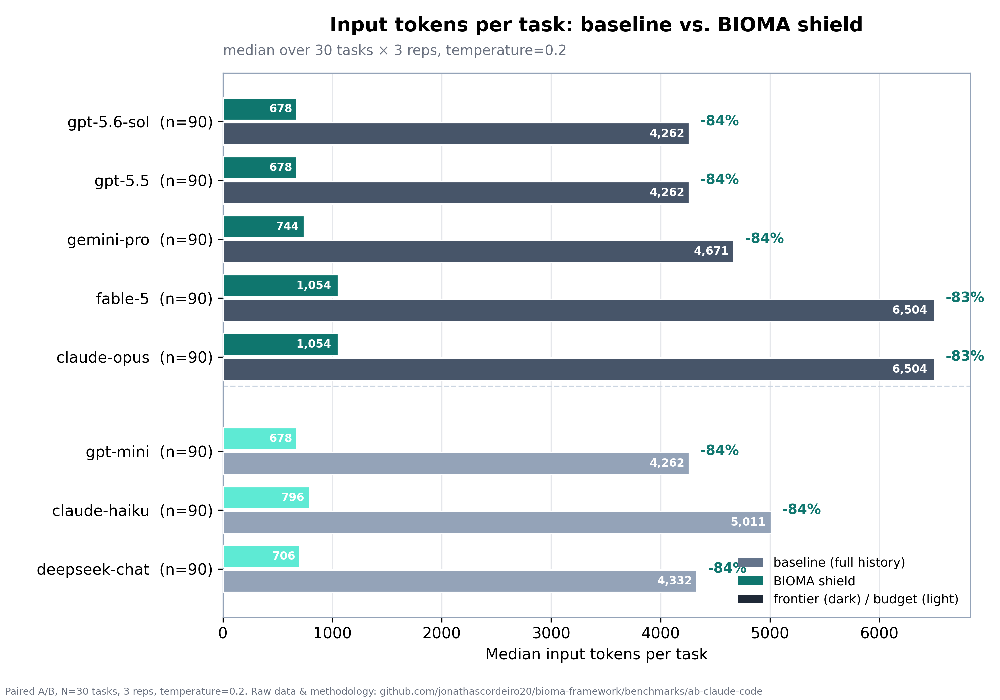
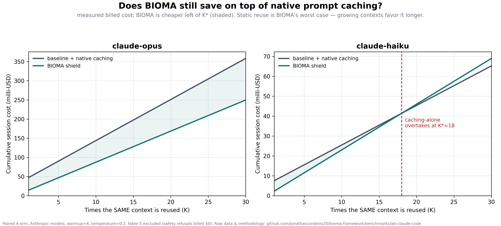
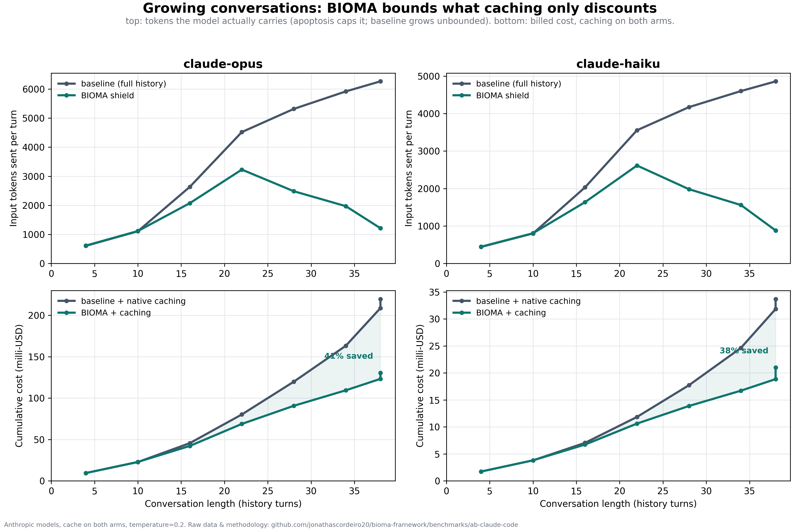

<div align="center">

# B.I.O.M.A.

### The local layer that cuts LLM cost, energy, and carbon — and lets an auditor **prove it**

**🌐 English · [Português](README.pt-BR.md)**

[](https://github.com/jonathascordeiro20/bioma-framework/actions/workflows/ci.yml)
[](https://pypi.org/project/bioma-framework/)
[](https://pypi.org/project/bioma-micro/)
[](https://doi.org/10.5281/zenodo.21401899)
[](LICENSE)


**A drop-in, provider-agnostic micro-kernel that prunes wasted LLM context *before* your prompt leaves the machine.**
Rust core, microsecond decisions, zero code changes. Point your `base_url` at it — that's the whole integration.

</div>

---

## The 30-second story

Every time an LLM app takes another turn, it **re-sends the entire conversation** — the model keeps no
state between calls. In real agent sessions that resent history is **50–60% of the token bill**, and it
grows every turn. Tokens cost money, latency, and **energy** — and, increasingly, a carbon number a
company is legally required to disclose.

**B.I.O.M.A. deletes the dead weight in-process.** A ~500-line Rust kernel applies *context apoptosis* —
class-aware, half-life decay that drops stale history and keeps what matters — in about **1 microsecond**,
with **no model, no rewrite, and no broken prompt caching**. You keep your provider, your SDK, your keys.

Then it does the thing nobody else does: it turns the measured savings into a **signed, tamper-evident
carbon ledger** an external auditor can verify without trusting you.

> **This is not "make the model smarter."** It makes the *processing* cheaper, faster, safer, and
> **auditable** — locally, before anything leaves your machine.

---

## How it works — in plain English

**Think of it as an editor for the conversation.** Before each message goes to the AI, B.I.O.M.A. trims the
parts of the chat history that no longer matter — the way you'd cut a long email thread down to the one
relevant reply before forwarding it. You get **the same answer**; you just stop paying to re-send the whole
thread, every single turn.

<p align="center">
  
</p>

1. **The problem** — an AI model remembers nothing between messages, so your app re-sends the *entire*
   conversation every turn. In real sessions, 50–60% of that is stale filler that just runs up the bill.
2. **B.I.O.M.A.** — a tiny, fast component inside your own app deletes the stale history in about a
   millionth of a second, keeping the system instructions and what's actually relevant. No AI model is
   involved in the trimming; your provider, keys, and code stay exactly the same.
3. **What's sent** — a small, clean payload. The model answers exactly as it would have — you just paid to
   send a paragraph instead of the whole thread.

And because none of this matters if you can't prove it, B.I.O.M.A. writes down every trim and can produce a
**digitally signed report** of the tokens, cost, and carbon saved — one a third party (an auditor, a
journalist, a regulator) can verify without taking your word for it.

---

## By the numbers — all measured, all reproducible

From a paired A/B benchmark: **8 models × 30 coding tasks × 3 reps = 1,440 real API calls.**
Raw data, code, and charts live in [`benchmarks/ab-claude-code`](benchmarks/ab-claude-code/results/RESULTS.md).

| | |
|---|---|
| 🔻 **−84.7%** median input tokens | across all 8 models (Wilcoxon p ≈ 1.7e-16) |
| ✅ **Quality-neutral** | paired success 81.2% → 81.9% |
| 💸 **−42% vs. free prompt caching** | measured on top of native caching, not instead of it |
| 📈 **5.2–5.5× fewer tokens** carried | in growing conversations, where caching can't help |
| ⚡ **~1 µs** per pruning decision | Rust kernel, no auxiliary model |
| 🔒 **Signed & verifiable** | carbon/cost ledger a third party can check |

---

## See it

**One shield, every model.** Median input tokens per task, baseline vs. BIOMA:



**"But native caching is free — why bother?"** We ran that as its own experiment. BIOMA is cheaper
*on top of* caching, and on the flagship model it wins at **every** session length:



**Real sessions grow.** Caching discounts the price of the history, but the model still *carries* it.
Apoptosis keeps it bounded — the BIOMA curve literally bends back down while the baseline climbs:



*(We also publish the chart that stops an inflated headline — savings depend on how stale your context is —
so you can locate your own workload instead of trusting one number:
[`reduction_by_stale_ratio.png`](benchmarks/ab-claude-code/results/charts/reduction_by_stale_ratio.png).)*

---

## What makes it different

- **Deletion-only, cache-safe by construction.** The surviving prefix stays byte-identical, so your
  provider's prompt cache still hits. Neural prompt compressors *rewrite* the prompt and break caching;
  BIOMA composes with it instead.
- **Local & provider-agnostic.** 100% in-process. Harden the payload here, then dispatch to
  **Anthropic, Google, OpenAI** — or anything — with *your* SDK. Nothing to send to a SaaS.
- **Honest by default.** Every request writes a JSONL audit line (tokens before/after, what was purged,
  kernel µs). We document where it *loses*: against agents that already manage context it's a correct
  no-op; on low-stale context it saves less.

---

## Auditable carbon ledger

A carbon or cost claim is worth nothing if a third party can't verify it. So the savings ship as a
**signed, tamper-evident ledger**:

```bash
pip install "bioma-framework[ledger]"
bioma-carbon-ledger keygen  --out issuer                      # Ed25519 keypair
bioma-carbon-ledger build   bioma_gateway_audit.jsonl --grid br --price-in 2.0 \
                            --key issuer.key --out ledger.json
bioma-carbon-ledger verify  ledger.json --pub issuer.pub --audit bioma_gateway_audit.jsonl
```

Tokens are **measured**; the audit is **hash-chained** (alter or drop any row and the chain breaks);
the ledger is **Ed25519-signed** (verified with the public key alone); energy uses **declared, versioned**
coefficient bounds (low/mid/high — the reduction % is exact). `verify` catches both attacks: forge the
number → `signature INVALID`; tamper the audit → `recompute MISMATCH`. Emissions are labeled an
**avoided-emissions counterfactual** (GHG Protocol) — never netted against Scope 1/2/3, never an offset.

---

## Quickstart

```bash
pip install bioma-suite            # EVERYTHING in one command, then:
bioma-doctor                       # verify the install (exit 0 = healthy)
```

Or install just what you need:

```bash
pip install bioma-framework              # core: Rust kernel + Python API
pip install "bioma-framework[gateway]"     # + drop-in OpenAI/Anthropic gateway
pip install "bioma-framework[monitor]"     # + live terminal cockpit (bioma-monitor)
pip install "bioma-framework[ledger]"      # + signed carbon ledger
```

### Drop-in gateway — zero code changes

```python
from openai import OpenAI
client = OpenAI(base_url="http://localhost:8790/v1", api_key="...")   # the only change

# Any Anthropic-compatible client: set ANTHROPIC_BASE_URL=http://localhost:8790
```

Proven with the official SDKs on real models: **−78% (OpenAI) / −33% (Anthropic)** billed input,
answer intact, streaming works, tool-call pairs preserved.

### Use it as a library (any provider)

```python
from bioma.firewall_client import CognitiveFirewall

fw = CognitiveFirewall(vault={"db_password": DB_PW})     # secrets to protect
h  = fw.shield(history, "refactor this function")        # clean, dehydrated, secret-free
#   h.prompt / h.system  → send with YOUR SDK
#   h.telemetry          → apoptosis_reduction, saturation, kernel_latency_us
```

### Watch it live

```bash
bioma-monitor                      # follows the gateway audit log: reduction, µs, cost, /health
```

---

## How it works — three primitives

| Mechanism | What it does |
|---|---|
| **Context apoptosis** | Class-aware half-life decay dehydrates stale/verbose history before dispatch — the −84% engine. |
| **Cognitive firewall** | Secret redaction (text *and* pixels via OCR), cognitive-DDoS/flood detection, dispatch timeout guard. |
| **Hormonal bus** | Lock-free µs signalling substrate (~2M signals/s) — the kernel's nervous system. |

100% local. Distributed as `bioma-micro` (Rust kernel) + `bioma-framework` (Python layer), abi3 wheels
for Linux/macOS/Windows — no Rust toolchain needed to install.

---

## Proof & reproducibility

- **[`benchmarks/ab-claude-code/results/RESULTS.md`](benchmarks/ab-claude-code/results/RESULTS.md)** — the full writeup: methodology, the 1,440-call dataset, the caching experiments, every chart, and honest limitations.
- **[`FINDINGS.md`](FINDINGS.md)** — ground-truth evaluation, including what we tested and **refuted** (multi-LLM "mitosis" does not improve quality — so it is not in the product).
- **Citable snapshot:** [Zenodo DOI 10.5281/zenodo.21401899](https://doi.org/10.5281/zenodo.21401899).
- Every number above traces to a file in the repo. We welcome reproductions that disagree — divergent results get linked here.

---

## License

Fair-source under the **Functional Source License ([FSL-1.1-MIT](LICENSE))**: read it, run it, and build on
it for any non-competing purpose. Each release automatically becomes **MIT two years** after its date. The
only limit is repackaging it as a competing product.

<div align="center">

**Harden the payload, not the model.**

</div>
