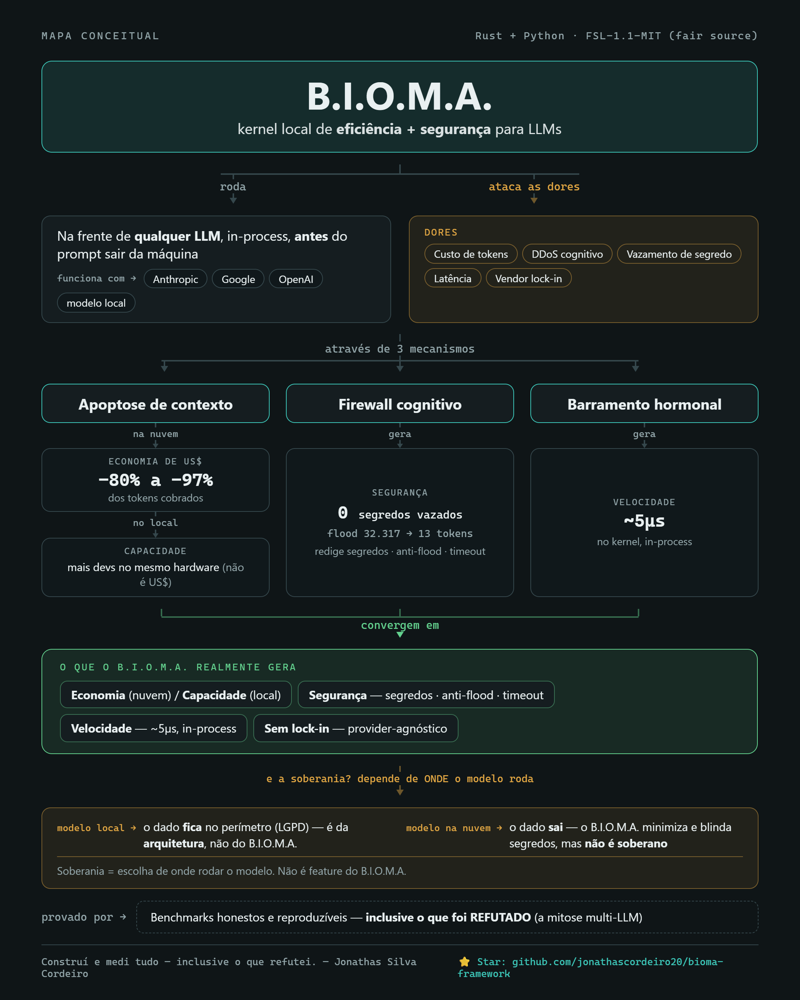

# B.I.O.M.A.

**🌐 [English](README.md) · Português**

[](https://github.com/jonathascordeiro20/bioma-framework/actions/workflows/ci.yml)
[](LICENSE)


**Um micro-kernel local, provider-agnóstico, de eficiência e segurança para aplicações de LLM.**

<p align="center">
  
</p>

O B.I.O.M.A. é um artefato plugável — um kernel em Rust lock-free (`bioma_micro`) mais uma
fina camada Python — que você embute em *qualquer* projeto ou arquitetura que fale com um
LLM. Ele não tenta deixar o modelo "mais inteligente". Ele torna o *processamento* mais
barato, rápido e seguro, in-process, antes do seu prompt sair da máquina:

- **Apoptose de contexto** — desidrata contexto desperdiçado/obsoleto (−80% de tokens de
  entrada; até −97% em sessões longas).
- **Firewall cognitivo** — redação de segredos, detecção de DDoS cognitivo/flood, e um
  timeout guard no despacho.
- **Barramento hormonal** — substrato de sinalização lock-free em μs (~2M sinais/s).

100% local. Provider-agnóstico: endureça o payload aqui e mande pra **Anthropic, Google,
OpenAI** — ou qualquer coisa — com o *seu* SDK.

> **Novo por aqui?** [`OVERVIEW.pt-BR.md`](OVERVIEW.pt-BR.md) explica o que é o B.I.O.M.A., a
> dor que ele ataca, e os benchmarks reais como prova. Implantação passo a passo (modelos locais
> e online) em [`IMPLEMENTATION.pt-BR.md`](IMPLEMENTATION.pt-BR.md). Toda alegação é medida e
> auditada em [`FINDINGS.pt-BR.md`](FINDINGS.pt-BR.md), inclusive o que testamos e **refutamos**
> (a "mitose" multi-LLM não melhora qualidade — não faz parte do produto).

## Use como biblioteca (qualquer provedor)

```python
from bioma.firewall_client import CognitiveFirewall

fw = CognitiveFirewall(vault={"db_password": DB_PW})   # segredos a proteger

# (a) artefato PURO — endureça e chame SEU provedor com SEU SDK:
h = fw.shield(history, "refatore esta função")
#   h.prompt / h.system  → payload limpo, desidratado, sem segredo
#   h.telemetry          → saturação, red_alert, apoptosis_reduction, kernel_latency_us

import anthropic                                        # ou google.genai, ou openai
msg = anthropic.Anthropic().messages.create(
    model="claude-sonnet-5", max_tokens=1024,
    system=h.system or "", messages=[{"role": "user", "content": h.prompt}])

# (b) traga seu dispatcher async (Anthropic/Google/OpenAI), mantendo os guards:
shield = await fw.harden(history, "refatore", dispatch_fn=meu_provedor_async)
#   → timeout guard + redação de segredo na resposta, automáticos
```

O kernel Rust também é usável direto:

```python
import bioma_micro as k
k.dehydrate([("regras de sistema", k.SYSTEM), ("log verboso " * 200, k.TOOL)])  # → -80% tokens
k.saturation_scan(payload)     # score de DDoS cognitivo 0..1 (flood ≈ 1.0)
```

## Resultados provados (ground truth)

| Capacidade | Resultado | Fonte |
|---|---|---|
| Apoptose de contexto | **−80% tokens de entrada** (até −97% em sessão longa) | `tests/test_enxuto_efficiency.py` |
| Preservação de qualidade da resposta | **10/10 paridade, 100% de acerto com −97% de tokens** (5 modelos online, probes objetivas) | `tests/test_quality_preservation.py` · `reports/BIOMA_QUALITY_PRESERVATION.md` |
| Energia medida por dispatch | **2.714,7 J → 69,5 J (−97,4%)**, com paridade de qualidade (Llama 3.2 1B local, fuel gauge de bateria, idle subtraído) | `tests/test_energy_local.py` · `reports/BIOMA_ENERGY_LOCAL.md` |
| Apoptose de contexto em visão (loops de screenshot de agentes) | **6/6 paridade, 100% de acerto com −56% de tokens reais** (−77% com 24 passos; payload desidratado é O(1) no tamanho da sessão) — 3 modelos de visão, probes rendidas nos pixels | `tests/test_vision_quality_preservation.py` · `reports/BIOMA_VISION_QUALITY.md` |
| Destilação de imagens (dedup keep-latest + OCR + estrutura determinística de formas) | **100% das respostas com −74% de tokens vs enviar toda imagem** — imagens antigas viram blocos de ~25–86 tokens; caption por VLM local medido e rejeitado (confabula rótulos) | `tests/test_vision_distill.py` · `reports/BIOMA_VISION_DISTILL.md` |
| Benchmark de custo em dev-workloads (7 modelos de agentes, usage e preços reais do OpenRouter) | **−57% a −86% de custo mediano com paridade de qualidade** — 126 execuções reais, réplicas pareadas, falhas em primeira página (Fable 5×T1 braço B vazio 3/3) | `tests/benchmark_dev_openrouter.py` · `resultados/relatorio.md` · `resultados/SIMULACAO_MERCADO.md` |
| Gateway drop-in (superfícies OpenAI **e Anthropic**, cache-safe, ciente de pares de tool) | **−78% (OpenAI) / −33% (Anthropic) de tokens de entrada faturados, resposta íntegra** mudando só a `base_url` — provado com os dois SDKs oficiais em modelos reais; o Claude Code fala a superfície Anthropic | `bioma/gateway.py` · `tests/test_gateway.py` · `tests/prove_gateway_dropin.py` · `tests/prove_anthropic_surface.py` |
| Apoptose × prompt caching (cache real da Anthropic) | **−65% de custo líquido após o desconto de cache** — o prefixo durável acerta o *mesmo* cache nos dois braços; a economia vem de purgar o miolo nunca-cacheável | `tests/measure_cache_interaction.py` · `resultados/MEDICOES_GATEWAY.md` |
| Claude Code real E2E (CLI pelo gateway) | **resolve tarefas reais de bug+feature, pytest verde** mudando só a `ANTHROPIC_BASE_URL`; aqui a apoptose é um **no-op seguro** (o Claude Code auto-gerencia o contexto — nada a purgar), e o valor aparece em agentes que não fazem isso (−84% medido) | `tests/e2e_claude_code.py` · `resultados/E2E_CLAUDE_CODE.md` |
| Agente E2E real de tool-calling (corrige um bug real até pytest verde) | **−84% de tokens de entrada acumulados com paridade de tarefa** em agente de sessão longa (−0% numa tarefa de 3 turnos — apoptose é no-op correto sem peso morto) | `tests/e2e_agent_gateway.py` · `resultados/MEDICOES_GATEWAY.md` |
| Barramento hormonal | **~2M sinais/s @ ~5μs**, limitado sob 10× de carga | bench arquivado (repo de pesquisa) |
| Mitigação de DDoS cognitivo | flood de 15k tokens → desidratado antes do despacho | `tests/test_sovereign_defense.py` |
| Redação de segredos | valores do vault nunca chegam ao modelo | `reports/BIOMA_IMMUNITY_VERDICT.md` |
| Redação de segredos em pixels (fecha a lacuna que declaramos) | **um modelo de visão real transcreve uma chave AWS/OpenAI do screenshot original mas só `████` do redigido** — OCR + máscara de região, client-side | `tests/test_vision_secret_redaction.py` · `reports/BIOMA_PIXEL_SECRETS.md` |

## Frugal AI — o KPI oficial: energia por token

O B.I.O.M.A. é uma **camada Frugal AI client-side que reduz de forma auditável o
custo energético de inferência de LLM por deployment**. A auditoria por dispatch
do kernel (tokens antes/depois) *é* o KPI: a redução percentual é exata e
independente de coeficiente. Um benchmark reproduzível
(`tests/test_esg_benchmark.py` → `reports/BIOMA_ESG_BENCHMARK.md`) converte a
economia de tokens medida em estimativas limitadas de Wh/gCO2e com coeficientes
declarados da literatura (0,5–1,3 kWh/M tokens; presets de grid; contrafactual
ajustado por caching), com os helpers de conversão em `bioma/esg.py`. É uma
alegação por deployment — não global; escala com adoção e com o seu grid.

## Instalação

```bash
pip install bioma            # core: micro-kernel Rust + API Python
pip install bioma[gateway]   # + o gateway drop-in OpenAI/Anthropic
pip install bioma[all]       # + client, anthropic e o tier de visão
```

O install core já traz o kernel Rust compilado (`bioma_micro`) como wheel binário
— sem toolchain Rust. Os extras (`gateway`, `client`, `anthropic`, `vision`) são
opt-in para manter a base leve. Para mantenedores, publicar é um tag
(`git tag v1.0.0 && git push --tags` → o workflow `Release` constrói os wheels
multi-plataforma e publica no PyPI).

## Início rápido (local)

```bash
# Compile e instale o micro-kernel Rust (extensão PyO3)
python -m pip install maturin
cd bioma_micro && maturin build --release && \
  pip install --force-reinstall target/wheels/bioma_micro-*.whl && cd ..

# Rode a suíte de testes (offline, determinística)
pip install pytest fastapi "openai>=1"
python -m pytest tests/test_kernel.py tests/test_firewall.py tests/test_server.py -q
```

Opcional: um runner FastAPI local (`bioma.server`, `GET /health` + `POST /v1/dispatch`) e
uma imagem de container local (`deploy/Dockerfile.lean`) estão inclusos — sem serviço
hospedado.

## Estrutura

```
bioma_micro/   micro-kernel Rust/PyO3 — barramento hormonal + apoptose + saturation_scan
bioma/         Python: CognitiveFirewall, LeanOpenRouterClient, servidor local
tests/         suíte unitária (kernel, firewall, server) + validações reais end-to-end
FINDINGS.md    avaliação ground-truth (provado / refutado), reproduzível
reports/       veredito de imunidade (APT war-game)
```

## Licença

Fair-source sob a **Functional Source License (FSL-1.1-MIT)** ([`LICENSE`](LICENSE)):
leia, execute e construa em cima para qualquer finalidade não-concorrente. O único limite é
reempacotá-la como produto concorrente, e cada release vira MIT dois anos após sua data.
