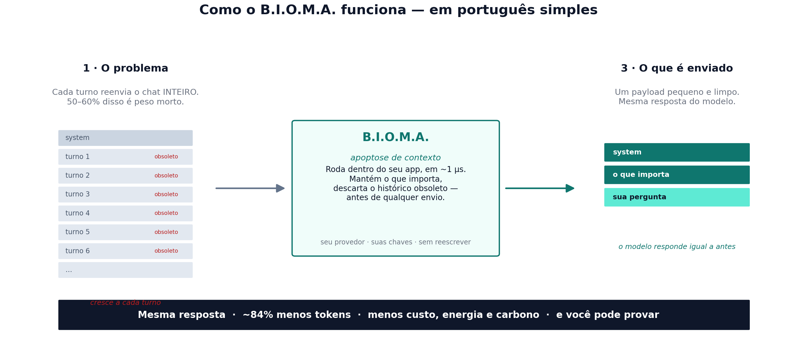

<div align="center">

# B.I.O.M.A.

### A camada local que corta custo, energia e carbono de LLM — e deixa um auditor **provar isso**

**[🌐 English](README.md) · Português**

[](https://github.com/jonathascordeiro20/bioma-framework/actions/workflows/ci.yml)
[](https://pypi.org/project/bioma-framework/)
[](https://pypi.org/project/bioma-micro/)
[](https://doi.org/10.5281/zenodo.21401899)
[](LICENSE)


**Um micro-kernel drop-in e agnóstico de provedor que poda o contexto desperdiçado do LLM *antes* do prompt sair da máquina.**
Núcleo em Rust, decisões em microssegundos, zero mudança de código. Aponte seu `base_url` para ele — essa é a integração inteira.

</div>

---

## A história em 30 segundos

Toda vez que um app de LLM dá mais um turno, ele **reenvia a conversa inteira** — o modelo não guarda
estado entre chamadas. Em sessões reais de agente, esse histórico reenviado é **50–60% da conta de tokens**,
e cresce a cada turno. Tokens custam dinheiro, latência e **energia** — e, cada vez mais, um número de
carbono que a empresa é obrigada por lei a divulgar.

**O B.I.O.M.A. deleta o peso morto in-process.** Um kernel Rust de ~500 linhas aplica *apoptose de contexto*
— decaimento por meia-vida, ciente de classe, que descarta o histórico obsoleto e mantém o que importa — em
cerca de **1 microssegundo**, **sem modelo, sem reescrever, e sem quebrar o prompt caching**. Você mantém seu
provedor, seu SDK, suas chaves.

E então faz o que ninguém mais faz: transforma a economia medida num **ledger de carbono assinado e à prova
de adulteração** que um auditor externo verifica sem confiar em você.

> **Isto não é "deixar o modelo mais inteligente".** É deixar o *processamento* mais barato, rápido, seguro e
> **auditável** — localmente, antes de qualquer coisa sair da sua máquina.

---

## Como funciona

**Pense nele como um editor da conversa.** Antes de cada mensagem ir para a IA, o B.I.O.M.A. apara as partes
do histórico do chat que já não importam — do jeito que você cortaria uma thread longa de e-mail até a única
resposta relevante antes de encaminhar. Você recebe **a mesma resposta**; só para de pagar para reenviar a
thread inteira, a cada turno.

<p align="center">
  
</p>

1. **O problema** — um modelo de IA não lembra nada entre mensagens, então seu app reenvia a conversa
   *inteira* a cada turno. Em sessões reais, 50–60% disso é enchimento obsoleto que só engorda a conta.
2. **B.I.O.M.A.** — um componente pequeno e rápido, dentro do seu próprio app, deleta o histórico obsoleto em
   cerca de um milionésimo de segundo, mantendo as instruções de sistema e o que é de fato relevante. Nenhum
   modelo de IA participa da poda; seu provedor, suas chaves e seu código ficam exatamente iguais.
3. **O que é enviado** — um payload pequeno e limpo. O modelo responde exatamente como responderia — você só
   pagou para enviar um parágrafo em vez da thread inteira.

E como nada disso importa se você não pode provar, o B.I.O.M.A. anota cada poda e produz um **relatório
assinado digitalmente** dos tokens, custo e carbono economizados — que um terceiro (um auditor, um
jornalista, um regulador) verifica sem precisar acreditar na sua palavra.

---

## Em números — tudo medido, tudo reproduzível

De um benchmark A/B pareado: **8 modelos × 30 tarefas de código × 3 reps = 1.440 chamadas reais de API.**
Dados brutos, código e gráficos em [`benchmarks/ab-publico`](benchmarks/ab-publico/results/RESULTS.md).

| | |
|---|---|
| 🔻 **−84,7%** de tokens de entrada (mediana) | em todos os 8 modelos (Wilcoxon p ≈ 1,7e-16) |
| ✅ **Qualidade neutra** | sucesso pareado 81,2% → 81,9% |
| 💸 **−42% vs. prompt caching grátis** | medido *em cima* do caching nativo, não no lugar dele |
| 📈 **5,2–5,5× menos tokens** carregados | em conversas que crescem, onde o caching não ajuda |
| ⚡ **~1 µs** por decisão de poda | kernel Rust, sem modelo auxiliar |
| 🔒 **Assinado e verificável** | ledger de carbono/custo que um terceiro confere |

---

## Veja

**Um shield, todos os modelos.** Tokens de entrada medianos por tarefa, baseline vs. BIOMA:


**"Mas o caching nativo é grátis — por que me importar?"** Rodamos isso como experimento próprio. O BIOMA é
mais barato *em cima* do caching, e no modelo de ponta vence em **todo** comprimento de sessão:


**Sessões reais crescem.** O caching desconta o preço do histórico, mas o modelo ainda o *carrega*. A
apoptose o mantém limitado — a curva do BIOMA literalmente dobra para baixo enquanto o baseline sobe:


*(Publicamos também o gráfico que impede uma manchete inflada — a economia depende de quão obsoleto é o seu
contexto — para você localizar o seu próprio workload em vez de confiar num único número:
[`reduction_by_stale_ratio.png`](benchmarks/ab-publico/results/charts/reduction_by_stale_ratio.png).)*

---

## O que o diferencia

- **Somente deleção, cache-safe por construção.** O prefixo sobrevivente fica byte-idêntico, então o prompt
  cache do seu provedor ainda acerta. Compressores neurais de prompt *reescrevem* o prompt e quebram o
  caching; o BIOMA compõe com ele.
- **Local e agnóstico de provedor.** 100% in-process. Endureça o payload aqui e despache para **Anthropic,
  Google, OpenAI** — ou qualquer um — com o *seu* SDK. Nada para mandar para um SaaS.
- **Honesto por padrão.** Cada requisição grava uma linha de audit JSONL (tokens antes/depois, o que foi
  purgado, µs do kernel). Documentamos onde ele *perde*: contra agentes que já gerenciam contexto é um no-op
  correto; em contexto pouco obsoleto economiza menos.

---

## Ledger de carbono auditável

Uma alegação de carbono ou custo não vale nada se um terceiro não pode verificar. Então a economia vem como
um **ledger assinado e à prova de adulteração**:

```bash
pip install "bioma-framework[ledger]"
bioma-carbon-ledger keygen  --out issuer                      # par de chaves Ed25519
bioma-carbon-ledger build   bioma_gateway_audit.jsonl --grid br --price-in 2.0 \
                            --key issuer.key --out ledger.json
bioma-carbon-ledger verify  ledger.json --pub issuer.pub --audit bioma_gateway_audit.jsonl
```

Tokens são **medidos**; o audit é **hash-chained** (alterar ou remover qualquer linha quebra a cadeia); o
ledger é **assinado com Ed25519** (verificado só com a chave pública); a energia usa **coeficientes
declarados e versionados** com limites (baixo/central/alto — a redução % é exata). O `verify` pega os dois
ataques: forjar o número → `signature INVALID`; adulterar o audit → `recompute MISMATCH`. Emissões rotuladas
como **contrafactual de emissões evitadas** (GHG Protocol) — nunca abatidas do Scope 1/2/3, nunca offset.

---

## Início rápido

```bash
pip install bioma-suite            # TUDO num comando só, depois:
bioma-doctor                       # confira a instalação (exit 0 = saudável)
```

Ou instale só o que precisa:

```bash
pip install bioma-framework              # core: kernel Rust + API Python
pip install "bioma-framework[gateway]"     # + gateway drop-in OpenAI/Anthropic
pip install "bioma-framework[monitor]"     # + cockpit de terminal ao vivo (bioma-monitor)
pip install "bioma-framework[ledger]"      # + ledger de carbono assinado
```

### Gateway drop-in — zero mudança de código

```python
from openai import OpenAI
client = OpenAI(base_url="http://localhost:8790/v1", api_key="...")   # a única mudança

# Qualquer cliente compatível com Anthropic: defina ANTHROPIC_BASE_URL=http://localhost:8790
```

Comprovado com os SDKs oficiais em modelos reais: **−78% (OpenAI) / −33% (Anthropic)** de input faturado,
resposta intacta, streaming funciona, pares de tool-call preservados.

### Use como biblioteca (qualquer provedor)

```python
from bioma.firewall_client import CognitiveFirewall

fw = CognitiveFirewall(vault={"db_password": DB_PW})     # segredos a proteger
h  = fw.shield(history, "refatore esta função")          # limpo, desidratado, sem segredos
#   h.prompt / h.system  → envie com o SEU SDK
#   h.telemetry          → apoptosis_reduction, saturation, kernel_latency_us
```

### Acompanhe ao vivo

```bash
bioma-monitor                      # segue o audit do gateway: redução, µs, custo, /health
```

---

## Como funciona — três primitivas

| Mecanismo | O que faz |
|---|---|
| **Apoptose de contexto** | Decaimento por meia-vida ciente de classe desidrata histórico obsoleto/verboso antes do envio — o motor dos −84%. |
| **Firewall cognitivo** | Redação de segredos (texto *e* pixels via OCR), detecção de cognitive-DDoS/flood, guarda de timeout de dispatch. |
| **Barramento hormonal** | Substrato de sinalização lock-free em µs (~2M sinais/s) — o sistema nervoso do kernel. |

100% local. Distribuído como `bioma-micro` (kernel Rust) + `bioma-framework` (camada Python), wheels abi3
para Linux/macOS/Windows — sem toolchain Rust para instalar.

---

## Prova e reprodutibilidade

- **[`benchmarks/ab-publico/results/RESULTS.md`](benchmarks/ab-publico/results/RESULTS.md)** — o writeup completo: metodologia, o dataset de 1.440 chamadas, os experimentos de caching, cada gráfico e as limitações honestas.
- **[`FINDINGS.md`](FINDINGS.md)** — avaliação ground-truth, incluindo o que testamos e **refutamos** (a "mitose" multi-LLM não melhora qualidade — por isso não está no produto).
- **Snapshot citável:** [Zenodo DOI 10.5281/zenodo.21401899](https://doi.org/10.5281/zenodo.21401899).
- Todo número acima traça até um arquivo do repo. Reproduções que discordem são bem-vindas — resultados divergentes são linkados aqui.

---

## Licença

Fair-source sob a **Functional Source License ([FSL-1.1-MIT](LICENSE))**: leia, rode e construa em cima para
qualquer fim não-concorrente. Cada release vira **MIT dois anos** após sua data. O único limite é reempacotar
como produto concorrente.

<div align="center">

**Endureça o payload, não o modelo.**

</div>
