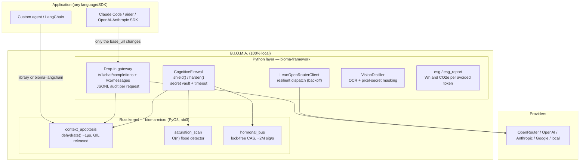

# B.I.O.M.A. — Complete Technical Guide

> What it is, how it works inside, and how to use it — from a developer's laptop
> to a regulated company's infrastructure. Every number in this guide comes from
> reproducible benchmarks in the repository, with raw data and declared limits.

---

## 1. What it is (and what it is not)

**B.I.O.M.A.** is a **local efficiency-and-security micro-kernel for LLM
applications**: a thin layer, in Rust with a Python interface, that intercepts
every request **before it leaves your machine** and does three things, in
microseconds:

1. **Context apoptosis** — removes dead weight from the history (verbose tool
   logs, old resolved turns) via class-aware half-life decay, cutting input
   tokens — and therefore cost — auditably.
2. **Cognitive firewall** — redacts secrets from the payload (text and pixels
   via OCR), detects repetitive floods (cognitive-DDoS / denial-of-wallet) and
   bounds every dispatch with a timeout.
3. **Hormonal bus** — lock-free in-memory signalling (~2M signals/s, ~5 µs) to
   propagate alert states between components without locks.

**What it is NOT** (declared, measured limits):

- ❌ Not a semantic prompt-injection detector — the controls are deterministic;
  pair it with a semantic detector if that threat is primary.
- ❌ Does not deliver a universal "−X%": against clients that already manage
  context (e.g. Claude Code in short sessions) it is a **safe no-op (~0%)**.
  The gain is proportional to the client's waste.
- ❌ Does not preserve old untagged facts: durable information **must** be
  tagged `FACT` (usage contract, not a bug).

**Thesis in one sentence:** *structural pruning in µs where there is structure;
neural compression where there is none.* BIOMA exploits the metadata the client
already has (message classes + recency) — which is why it decides in ~1 µs what
a neural compressor takes seconds to decide worse (see §4).

---

## 2. Full architecture



### 2.1 Rust kernel (`bioma-micro`) — the primitives + detectors

**Context apoptosis** (`context_apoptosis.rs`). Every history block gets a
*metabolic weight* by class and decays by half-life with age:

| Class | Initial weight ("oxygen") | Behavior |
| :--- | :---: | :--- |
| `SYSTEM` | 4.0 | **never purged** (reinforced every cycle) |
| `FACT` | 4.0 | **never purged** — this is where durable information lives |
| `USER` / `ASSISTANT` | 1.0 | decays by recency |
| `TOOL` | 0.25 | prime target — verbose logs die first |
| `THINKING` (1.1.0) | 0.15 | stale reasoning blocks — the cheapest to purge |

Survival formula (one-shot mode): a block of age `a` (0 = newest) survives if
`weight × 2^(−a/half_life) ≥ safe_threshold`. Pure Rust, no allocation on the
hot path, GIL released — decision in **~1 µs** for real histories.

Two APIs:

- `dehydrate(messages, half_life=6.0, safe_threshold=0.35, stable_prefix=0)` —
  one-shot, stateless; returns surviving blocks + full audit
  (`tokens_before/after`, `reduction`, `stable_prefix_tokens`,
  `kernel_latency_us`, `blocks_purged`). `stable_prefix` (1.1.0) is the
  cache-aware zone: the first N messages stay verbatim, guaranteeing a
  byte-identical prefix for the provider's prompt caching.
- `ContextApoptosis(half_life, safe_threshold, capacity, state_capacity=64)` —
  stateful incremental engine (`insert` → `dehydrate` cycles → `render`),
  atomic counters. Since 1.1.0 it carries the **purpose contract**
  (`set_purpose`), the **STATE ledger** (`note_state`, deduplicated and
  bounded) and `dehydrate(absorb=True)` — purged USER/ASSISTANT turns leave a
  one-line digest in STATE instead of vanishing without trace.

Economics and effort primitives (1.1.0):

- `consolidation_gain(prefix_tokens, purgeable_tokens, calls_ahead=8, ...)` —
  decides when rewriting a *cached* prefix pays off (defaults = Anthropic
  pricing: read 0.1× / write 1.25×). With cache reads at 0.1×, the typical
  break-even is 15+ calls — naive pruning of a cached prefix is expensive.
- `effort_gauge(text)` — O(n) complexity score (length, hard-task verbs by
  stem en+pt, constraints, code, digits, novelty; calibrated on 1,223 real
  agent prompts → 68/23/9/0.5% off/low/medium/high) → `tier` +
  `budget_tokens` (0/1k/4k/16k) + every raw signal for auditability. In the
  gateway: opt-in `BIOMA_AUTO_EFFORT` (never raises above the client's ask;
  downgrades an explicit budget only on confidently-trivial turns).

**Saturation detector** (`saturation_scan(text, window=8)`). Fraction of
duplicate 8-token shingles: ~1.0 = repetitive flood (RED ALERT), ~0.0 = natural
text. O(n), hashed shingles without materialization. A real 32,317-token flood
was detected with score 0.999 and dehydrated to 13 tokens.

**Hormonal bus** (`hormonal_bus.rs`). A fixed bank of atomic `f32` cells
(concentration per signal channel) updated with CAS loops — `inject` and
`sense` never take a lock. Events optionally mirrored into a bounded
`crossbeam-channel` for streaming consumers. Measured: ~2M signals/s, average
latency ~5 µs, stable p99 under 10× load.

### 2.2 Python layer (`bioma-framework`, `import bioma`)

**Drop-in gateway** (`bioma.gateway`) — the zero-code adoption path:

- **OpenAI** (`/v1/chat/completions`) and **Anthropic** (`/v1/messages`)
  surfaces — point any SDK's `base_url`, or Claude Code's
  `ANTHROPIC_BASE_URL`, at it and every request passes through apoptosis
  transparently. Top-level `system` is forwarded untouched. `count_tokens` is
  a passthrough (the client's accounting stays consistent).
- **Bridge mode** (`BIOMA_FORCE_KEY=1`): ignores the client's key and uses the
  environment's `OPENROUTER_API_KEY` — needed for Anthropic clients talking to
  an OpenRouter upstream.
- **JSONL audit** (`BIOMA_AUDIT_LOG`): one line per request with
  `tokens_before`, `tokens_after`, `reduction`, `kernel_latency_us`,
  `blocks_purged`, timestamp and model — the source of truth for proving
  savings.

**CognitiveFirewall** (`bioma.firewall_client`) — for those who want to harden
the payload and dispatch with their own SDK:

```python
fw = CognitiveFirewall(vault={"db_password": DB_PW})
h = fw.shield(history, "refactor this function")
# h.prompt / h.system  → dehydrated, secret-free payload
# h.telemetry          → saturation, red_alert, secrets_redacted,
#                        apoptosis_reduction, kernel_latency_us
```

Vault guarantee: the secret is redacted from the **outbound** payload and from
the response — an injection cannot exfiltrate what the model never received.
`harden()` adds dispatch with timeout and backoff (your own dispatcher or the
built-in OpenRouter one).

**VisionDistiller** (`bioma.vision`) — OCR + region masking: a screenshot with
an AWS key becomes an image with `████` before it leaves; perceptual
deduplication of repeated images. Opt-in (`BIOMA_REDACT_IMAGE_SECRETS=1`) —
OCR stays off the hot path by default.

**ESG** (`bioma.esg`, `bioma.esg_report`) — converts avoided tokens into
Wh/CO2e (literature coefficients, world/EU/US/BR grids, always with
low/central/high bounds) and generates a stakeholder/procurement report.

### 2.3 Integrations

**`bioma-langchain`** — `BiomaDehydrator`, an LCEL Runnable:

```python
from bioma_langchain import BiomaDehydrator
dehydrator = BiomaDehydrator()          # agentic default: threshold 0.2
chain = dehydrator | llm                # prunes the history before the model
print(dehydrator.last_audit)            # audit of the last call
# durable facts: HumanMessage("...", additional_kwargs={"bioma": "fact"})
```

---

## 3. Installation

```bash
pip install bioma-micro          # kernel only (abi3 wheels: Linux/macOS/Windows, Py>=3.8)
pip install bioma-framework      # full layer (import bioma) — pulls the kernel
pip install "bioma-framework[gateway]"   # + FastAPI/uvicorn for the gateway
pip install "bioma-framework[all]"       # + clients, anthropic and vision
pip install bioma-langchain      # LangChain integration
```

No Rust toolchain needed (binary wheels). Sources:
[github.com/jonathascordeiro20/bioma-framework](https://github.com/jonathascordeiro20/bioma-framework)
· citable snapshot: DOI
[10.5281/zenodo.21401899](https://doi.org/10.5281/zenodo.21401899).

---

## 4. The numbers (measured, with source and caveat)

| Scenario | Result | Source in the repo |
| :--- | :--- | :--- |
| Generic long session (16 rounds, resends everything) | **−95.8%** input, answer parity | `test_enxuto_efficiency.py` |
| Naive tool-calling agent (accumulated history) | **−84%** | `benchmarks/ab-publico/results/RESULTS.md` |
| Real Claude Code, long session, threshold 0.2 | **−22%** history, task solved in both arms, estimated cost −19% | `benchmarks/ab-publico/results/RESULTS.md` |
| Claude Code, short session | **~0% (safe no-op)** | idem |
| Real provider billing, identical payload | **4,604 → 32** input tokens | idem |
| Prompt-caching interaction | they compose: −76% cost with caching active | `benchmarks/ab-publico/results/cached/ANALYSIS_CACHED.txt` |
| Direct measurement with real `cache_control` (v1.3.0) | **−71% net cost AFTER the cache discount**; `stable_prefix` zone = zero regression | `resultados/cache_interaction.json` |
| Dynamic thinking budgets (`BIOMA_AUTO_EFFORT`, v1.3.1) | **−89% reasoning tokens** on a realistic mix; **−64% under a pytest gate, 0 divergent pairs** | `resultados/auto_effort*.json` + `reports/BIOMA_REVALIDACAO_V131.pt-BR.md` |
| Post-1.3.1 A/B revalidation (paid pilot, 20 pairs) | −82.2% median (ref. −83.8%), 0 divergent, real cost −65% | `benchmarks/ab-publico/results/rerun_v131.jsonl` |
| Quality under apoptosis (6 real models, objective probes) | 100% parity on S1/S2; S3 purges by design — reconfirmed on kernel 1.1.0 (3 models, 6/6) | `reports/BIOMA_QUALITY_PRESERVATION.md` |

Consolidated report with every caveat:
`benchmarks/ab-publico/results/RESULTS.md`.

---

## 5. Day-to-day use (developer)

### 5.1 Pure library — 5 lines

```python
import bioma_micro as bm

msgs = [("you are an ops copilot", bm.SYSTEM),
        ("FACT: the freeze ends on 2026-07-18", bm.FACT)] + \
       [(log, bm.TOOL) for log in tool_logs] + \
       [("what is the freeze date?", bm.USER)]

r = bm.dehydrate(msgs, safe_threshold=0.2)
prompt = "\n".join(r["kept"])            # dispatch this instead of the history
print(r["reduction"], r["kernel_latency_us"])
```

### 5.2 Claude Code / aider / any SDK — zero code changes

```bash
BIOMA_FORCE_KEY=1 BIOMA_SAFE_THRESHOLD=0.2 \
  python -m uvicorn bioma.gateway:app --port 8790
```

```bash
# Claude Code:
export ANTHROPIC_BASE_URL=http://127.0.0.1:8790
# OpenAI SDK:  OpenAI(base_url="http://127.0.0.1:8790/v1", ...)
# Anthropic SDK: Anthropic(base_url="http://127.0.0.1:8790", ...)
```

Every call writes a line to `bioma_gateway_audit.jsonl` — the "before/after"
you show whoever pays the bill.

### 5.3 LangChain

See §2.3 — a Runnable before the model, facts tagged with
`{"bioma": "fact"}`, audit in `.last_audit`.

### 5.4 Tuning — the decision that flips the sign of the result

| Profile | `safe_threshold` | Why |
| :--- | :---: | :--- |
| **Tool-calling agents** (Claude Code, aider, LangChain agents) | **0.2** | 0.35 purges even the freshest tool_result (0.25 × 2^(−1/6) = 0.223 < 0.35) → the agent redoes work and net cost gets WORSE. Measured: 0.2 preserves the fresh result and keeps −91% on the synthetic bench. |
| Chat / sessions without dense tool use | 0.35 (default) | maximum aggressiveness without side effects |
| `half_life` | 6.0 | raise to retain more turns; lower for very long sessions |

**The FACT contract:** any information that must survive the whole session
(rollback tokens, incident codes, decisions) must go in a `FACT` block. A
durable fact buried in an old USER turn **will be purged by design** — the S3
benchmark documents exactly that.

---

## 6. Enterprise use

### 6.1 Deployment patterns

**Sidecar per team/app** (simplest): the gateway runs next to the application
(same host/pod), each team points its `base_url`. Docker ready in
`deploy/Dockerfile.lean`.

**Central gateway** (platform): one instance per environment serving N
applications; the centralized JSONL audit becomes the LLM FinOps data source.
Tuning via env vars: `BIOMA_UPSTREAM` (provider), `BIOMA_HALF_LIFE`,
`BIOMA_SAFE_THRESHOLD`, `BIOMA_AUDIT_LOG`, `BIOMA_PORT/HOST`.

**Sovereign / air-gapped** (regulated): all processing is local by
construction — the kernel makes no network calls of its own; the only egress is
the dispatch to the provider YOU configure (including a local model). No SaaS
middleman: exactly the scenario hosted proxies cannot enter.

### 6.2 The honest business case

1. **Cost**: the gain is proportional to the waste. Measure first: run the
   gateway in observation mode for a week and read the audit — if your agents
   resend growing history (most custom agents do), the 40–90% input cut shows
   up in the JSONL before any promise is made.
2. **Security**: secret vault + pixel redaction + flood detector =
   deterministic, testable controls, mapped to the **OWASP LLM Top 10**
   (LLM02 Sensitive Information Disclosure, LLM10 Unbounded Consumption),
   **MITRE ATLAS** (Denial of ML Service, Cost Harvesting), **NIST AI RMF**
   (Measure/Manage functions via per-request telemetry) and **ISO/IEC 42001**
   (implemented evidence of data minimization). Details in the paper
   (§Framework Mapping).
3. **Audit**: the per-request JSONL is evidence — for FinOps, for the auditor,
   for the ESG report (MWh/tCO2e avoided per year, with bounds).

### 6.3 Adoption checklist (pilot → rollout)

- [ ] **Week 1 — measure without changing anything**: gateway as a proxy for
      the target app, `BIOMA_SAFE_THRESHOLD=0.2`, collect the JSONL audit.
      Advance criterion: average history reduction ≥ 20% with no functional
      regression.
- [ ] **Week 2 — validate quality**: reproduce
      `tests/test_quality_preservation.py` with scenarios from YOUR domain
      (planted objective probes — the harness is ready).
- [ ] **Weeks 3–4 — pilot with a real invoice**: compare the provider's
      billing before/after on the same workload. The number that matters is
      the provider's, not the estimate (we learned this by measuring: client
      estimates ≠ what the provider charges).
- [ ] **Rollout**: sidecar per app, dashboards over the JSONL, the `FACT` tag
      incorporated into the internal prompt-engineering guide.
- [ ] **Security gate**: if using the firewall, test the vault with synthetic
      secrets in your own format (the redaction harness lives in
      `tests/test_firewall.py` and `tests/test_vision_secret_redaction.py`).

### 6.4 Licensing

**FSL-1.1-MIT** (Functional Source License): internal use, non-commercial use
and professional services allowed; reselling BIOMA itself as a competing
product is prohibited; **each release converts to MIT after 2 years**. Code
100% auditable today — relevant for security procurement.

---

## 7. Operations and troubleshooting

| Symptom | Likely cause | Action |
| :--- | :--- | :--- |
| Reduction ~0% | client is already lean (history doesn't accumulate) | expected — safe no-op; confirm in the audit (`tokens_before` doesn't grow between requests) |
| Agent redoes work / more turns | threshold 0.35 purging fresh tool_results | `BIOMA_SAFE_THRESHOLD=0.2` |
| Model "forgot" a durable value | fact not tagged as `FACT` | tag the message (`role: "fact"` in the gateway; `{"bioma": "fact"}` in LangChain) |
| 401 from Claude Code via proxy | headless doesn't send `ANTHROPIC_API_KEY` without approval | use `ANTHROPIC_AUTH_TOKEN` (Bearer) |
| Client-side cost ≠ audit | the client's accounting is local (it can't see the pruning) | use the provider's billing + the JSONL audit as ground truth |
| Empty response from one specific model | provider filter/quirk (documented with Fable 5 via OpenRouter) | switch model/route; the cell is marked as an error, not as an apoptosis failure |

---

## 8. References

- Paper (8 pp., under arXiv submission): *B.I.O.M.A.: A Local
  Efficiency-and-Security Kernel for LLM Applications, with a Ground-Truth
  Refutation of Multi-Agent Mitosis* — under submission; citable snapshot via
  the DOI below.
- Citable snapshot: DOI [10.5281/zenodo.21401899](https://doi.org/10.5281/zenodo.21401899) · `CITATION.cff` in the repo.
- Consolidated benchmark: `benchmarks/ab-publico/results/RESULTS.md`.
- The mitosis autopsy (the negative result that started the project):
  `FINDINGS.md`.
