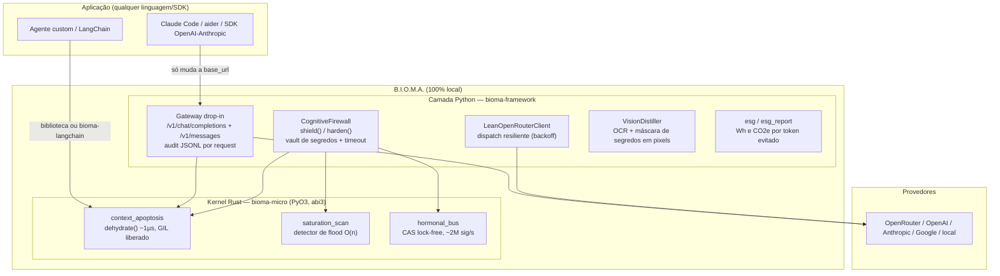

# B.I.O.M.A. — Guia Técnico Completo

> O que é, como funciona por dentro, e como usar — do laptop de um dev à
> infraestrutura de uma empresa regulada. Todos os números deste guia vêm de
> benchmarks reproduzíveis no repositório, com dados brutos e limites declarados.

---

## 1. O que é (e o que não é)

**B.I.O.M.A.** é um **micro-kernel local de eficiência e segurança para
aplicações LLM**: uma camada fina, em Rust com interface Python, que intercepta
cada requisição **antes de sair da sua máquina** e faz três coisas, em
microssegundos:

1. **Apoptose de contexto** — remove do histórico o peso morto (logs de
   ferramenta verbosos, turnos antigos resolvidos) por decaimento de meia-vida
   consciente de classes, cortando tokens de entrada — e portanto custo — de
   forma auditável.
2. **Firewall cognitivo** — redige segredos do payload (texto e pixels via OCR),
   detecta floods repetitivos (cognitive-DDoS / denial-of-wallet) e limita cada
   dispatch com timeout.
3. **Barramento hormonal** — sinalização lock-free em memória (~2M sinais/s,
   ~5 µs) para propagar estados de alerta entre componentes sem locks.

**O que ele NÃO é** (limites declarados, medidos):

- ❌ Não é um detector semântico de prompt injection — os controles são
  determinísticos; pareie com um detector semântico se essa ameaça for primária.
- ❌ Não entrega "−X% universal": contra clientes que já gerenciam contexto
  (ex.: Claude Code em sessões curtas) é um **no-op seguro (~0%)**. O ganho é
  proporcional ao desperdício do cliente.
- ❌ Não preserva fatos antigos não marcados: informação durável **deve** ser
  taggeada `FACT` (contrato de uso, não bug).

**Tese em uma frase:** *poda estrutural em µs onde há estrutura; compressão
neural (LLMLingua etc.) onde não há.* O BIOMA explora os metadados que o cliente
já tem (classes de mensagem + recência) — por isso decide em ~1 µs o que um
compressor neural leva segundos para decidir pior (ver §4).

---

## 2. Arquitetura completa



### 2.1 Kernel Rust (`bioma-micro`) — as duas primitivas + um detector

**Apoptose de contexto** (`context_apoptosis.rs`). Cada bloco do histórico
recebe um *peso metabólico* pela classe e decai por meia-vida com a idade:

| Classe | Peso inicial ("oxigênio") | Comportamento |
| :--- | :---: | :--- |
| `SYSTEM` | 4.0 | **nunca purgado** (reforçado a cada ciclo) |
| `FACT` | 4.0 | **nunca purgado** — é aqui que vive informação durável |
| `USER` / `ASSISTANT` | 1.0 | decai por recência |
| `TOOL` | 0.25 | alvo primário — logs verbosos morrem primeiro |

Fórmula da sobrevivência (modo one-shot): um bloco de idade `a` (0 = mais novo)
sobrevive se `peso × 2^(−a/half_life) ≥ safe_threshold`. Tudo puro Rust, sem
alocação no hot path, GIL liberado — decisão em **~1 µs** para históricos reais.

Duas APIs:
- `dehydrate(messages, half_life=6.0, safe_threshold=0.35)` — one-shot,
  stateless; retorna blocos sobreviventes + auditoria completa
  (`tokens_before/after`, `reduction`, `kernel_latency_us`, `blocks_purged`).
- `ContextApoptosis(half_life, safe_threshold)` — motor incremental com estado
  (`insert` → ciclos de `dehydrate` → `render`), contadores atômicos.

**Detector de saturação** (`saturation_scan(text, window=8)`). Fração de
shingles de 8 tokens duplicados: ~1.0 = flood repetitivo (RED ALERT), ~0.0 =
texto natural. O(n), shingles hasheados sem materialização. Um flood real de
32.317 tokens foi detectado com score 0,999 e desidratado para 13 tokens.

**Barramento hormonal** (`hormonal_bus.rs`). Banco fixo de células atômicas
`f32` (concentração por canal de sinal) atualizadas com CAS loops — `inject` e
`sense` nunca pegam lock. Eventos opcionalmente replicados num
`crossbeam-channel` limitado para consumidores em stream. Medido: ~2M sinais/s,
latência média ~5 µs, p99 estável sob 10× de carga.

### 2.2 Camada Python (`bioma-framework`, `import bioma`)

**Gateway drop-in** (`bioma.gateway`) — o caminho de adoção zero-código:
- Superfície **OpenAI** (`/v1/chat/completions`) e **Anthropic**
  (`/v1/messages`) — aponte a `base_url` de qualquer SDK, ou a
  `ANTHROPIC_BASE_URL` do Claude Code, e cada request passa pela apoptose
  transparentemente. `system` top-level é encaminhado intocado. `count_tokens`
  é passthrough (a contabilidade do cliente permanece consistente).
- **Modo ponte** (`BIOMA_FORCE_KEY=1`): ignora a chave do cliente e usa a
  `OPENROUTER_API_KEY` do ambiente — necessário para clientes Anthropic
  falando com upstream OpenRouter.
- **Auditoria JSONL** (`BIOMA_AUDIT_LOG`): uma linha por request com
  `tokens_before`, `tokens_after`, `reduction`, `kernel_latency_us`,
  `blocks_purged`, timestamp e modelo — a fonte de verdade para provar economia.

**CognitiveFirewall** (`bioma.firewall_client`) — para quem quer endurecer o
payload e despachar com o próprio SDK:

```python
fw = CognitiveFirewall(vault={"db_password": DB_PW})
h = fw.shield(history, "refatore esta função")
# h.prompt / h.system  → payload desidratado e sem segredos
# h.telemetry          → saturation, red_alert, secrets_redacted,
#                        apoptosis_reduction, kernel_latency_us
```

Garantia do vault: o segredo é redigido do payload **de saída** e da resposta —
uma injection não exfiltra o que o modelo nunca recebeu. `harden()` adiciona
dispatch com timeout e backoff (dispatcher próprio ou OpenRouter embutido).

**VisionDistiller** (`bioma.vision`) — OCR + máscara de regiões: um screenshot
com uma AWS key vira imagem com `████` antes de sair; deduplicação perceptual
de imagens repetidas. Opt-in (`BIOMA_REDACT_IMAGE_SECRETS=1`) — OCR fica fora
do hot path por padrão.

**ESG** (`bioma.esg`, `bioma.esg_report`) — converte tokens evitados em
Wh/CO2e (coeficientes da literatura, grids world/EU/US/BR, sempre com limites
baixo/central/alto) e gera relatório para stakeholder/procurement.

### 2.3 Integrações

**`bioma-langchain`** — `BiomaDehydrator`, um Runnable LCEL:

```python
from bioma_langchain import BiomaDehydrator
dehydrator = BiomaDehydrator()          # default agêntico: threshold 0.2
chain = dehydrator | llm                # poda o histórico antes do modelo
print(dehydrator.last_audit)            # auditoria da última chamada
# fatos duráveis: HumanMessage("...", additional_kwargs={"bioma": "fact"})
```

---

## 3. Instalação

```bash
pip install bioma-micro          # só o kernel (wheels abi3: Linux/macOS/Windows, Py>=3.8)
pip install bioma-framework      # camada completa (import bioma) — puxa o kernel
pip install "bioma-framework[gateway]"   # + FastAPI/uvicorn para o gateway
pip install "bioma-framework[all]"       # + clientes, anthropic e vision
pip install bioma-langchain      # integração LangChain
```

Sem toolchain Rust necessário (wheels binários). Fontes:
[github.com/jonathascordeiro20/bioma-framework](https://github.com/jonathascordeiro20/bioma-framework)
· snapshot citável: DOI
[10.5281/zenodo.21401899](https://doi.org/10.5281/zenodo.21401899).

---

## 4. Os números (medidos, com fonte e ressalva)

| Cenário | Resultado | Fonte no repo |
| :--- | :--- | :--- |
| Sessão longa genérica (16 rodadas, reenvia tudo) | **−95,8%** input, paridade de resposta | `test_enxuto_efficiency.py` |
| Agente tool-calling ingênuo (histórico acumulado) | **−84%** | `resultados/e2e_agent.json` |
| Claude Code real, sessão longa, threshold 0.2 | **−22%** histórico, tarefa resolvida nos 2 braços, custo estimado −19% | `resultados/E2E_CLAUDE_CODE.md` |
| Claude Code, sessão curta | **~0% (no-op seguro)** | idem |
| Billing real do provider, payload idêntico | **4.604 → 32** input tokens | idem |
| vs LLMLingua-2, mesmo budget (~50×), 3 rodadas | BIOMA **100%** de acurácia vs **0%**; 0,04 ms vs ~26 s | `reports/BIOMA_VS_LLMLINGUA.md` |
| Interação com prompt caching | compõem-se: −76% de custo com cache ativo | `resultados/cache_interaction.json` |
| Qualidade sob apoptose (6 modelos reais, probes objetivas) | paridade 100% em S1/S2; S3 purga by design | `reports/BIOMA_QUALITY_PRESERVATION.md` |

Relatório consolidado com todas as ressalvas:
`reports/BIOMA_BENCHMARK_COMPARATIVO.md`.

---

## 5. Uso no dia a dia (desenvolvedor)

### 5.1 Biblioteca pura — 5 linhas

```python
import bioma_micro as bm

msgs = [("você é um copiloto de ops", bm.SYSTEM),
        ("FACT: o freeze termina em 2026-07-18", bm.FACT)] + \
       [(log, bm.TOOL) for log in tool_logs] + \
       [("qual a data do freeze?", bm.USER)]

r = bm.dehydrate(msgs, safe_threshold=0.2)
prompt = "\n".join(r["kept"])            # despache isto no lugar do histórico
print(r["reduction"], r["kernel_latency_us"])
```

### 5.2 Claude Code / aider / qualquer SDK — zero mudança de código

```bash
BIOMA_FORCE_KEY=1 BIOMA_SAFE_THRESHOLD=0.2 \
  python -m uvicorn bioma.gateway:app --port 8790
```

```bash
# Claude Code:
export ANTHROPIC_BASE_URL=http://127.0.0.1:8790
# SDK OpenAI:  OpenAI(base_url="http://127.0.0.1:8790/v1", ...)
# SDK Anthropic: Anthropic(base_url="http://127.0.0.1:8790", ...)
```

Cada chamada gera uma linha no `bioma_gateway_audit.jsonl` — o "antes/depois"
que você mostra para quem paga a fatura.

### 5.3 LangChain

Ver §2.3 — um Runnable antes do modelo, fatos marcados com
`{"bioma": "fact"}`, auditoria em `.last_audit`.

### 5.4 Tuning — a decisão que muda o sinal do resultado

| Perfil | `safe_threshold` | Por quê |
| :--- | :---: | :--- |
| **Agentes tool-calling** (Claude Code, aider, LangChain agents) | **0.2** | 0.35 purga até o tool_result mais fresco (0,25 × 2^(−1/6) = 0,223 < 0,35) → o agente refaz trabalho e o custo líquido PIORA. Medido: 0.2 preserva o fresco e mantém −91% no sintético. |
| Chat / sessões sem tool denso | 0.35 (default) | máxima agressividade sem efeito colateral |
| `half_life` | 6.0 | suba para reter mais turnos; desça para sessões muito longas |

**O contrato FACT:** qualquer informação que precise sobreviver à sessão
inteira (tokens de rollback, códigos de incidente, decisões) deve ir num bloco
`FACT`. Fato durável enterrado num turno USER antigo **será purgado por
design** — o benchmark S3 documenta exatamente isso.

---

## 6. Uso nas empresas

### 6.1 Padrões de deployment

**Sidecar por equipe/app** (mais simples): o gateway roda ao lado da aplicação
(mesmo host/pod), cada time aponta sua `base_url`. Docker pronto em
`deploy/Dockerfile.lean`.

**Gateway central** (plataforma): uma instância por ambiente atendendo N
aplicações; o audit JSONL centralizado vira a fonte de dados de FinOps de LLM.
Tuning por env vars: `BIOMA_UPSTREAM` (provedor), `BIOMA_HALF_LIFE`,
`BIOMA_SAFE_THRESHOLD`, `BIOMA_AUDIT_LOG`, `BIOMA_PORT/HOST`.

**Soberano / air-gapped** (regulado): todo o processamento é local por
construção — o kernel não faz nenhuma chamada de rede própria; o único egress é
o dispatch ao provedor QUE VOCÊ configura (inclusive um modelo local). Nada de
SaaS intermediário: é exatamente o cenário onde proxies hospedados não entram.

### 6.2 O caso de negócio honesto

1. **Custo**: o ganho é proporcional ao desperdício. Meça primeiro: rode o
   gateway em modo observação por uma semana e leia o audit — se seus agentes
   reenviarem histórico crescente (a maioria dos agentes custom faz), o corte
   de 40–90% do input aparece no JSONL antes de qualquer promessa.
2. **Segurança**: vault de segredos + redação em pixels + detector de flood =
   controles determinísticos e testáveis, mapeados a **OWASP LLM Top 10**
   (LLM02 Sensitive Information Disclosure, LLM10 Unbounded Consumption),
   **MITRE ATLAS** (Denial of ML Service, Cost Harvesting), **NIST AI RMF**
   (funções Measure/Manage via telemetria por request) e **ISO/IEC 42001**
   (evidência implementada de minimização de dados). Detalhe no paper (§Framework
   Mapping).
3. **Auditoria**: o JSONL por request é evidência — para FinOps, para o
   auditor, para o relatório ESG (MWh/tCO2e evitados por ano, com limites).

### 6.3 Checklist de adoção (piloto → rollout)

- [ ] **Semana 1 — medir sem mudar nada**: gateway como proxy do app-alvo,
      `BIOMA_SAFE_THRESHOLD=0.2`, coletar audit JSONL. Critério de avanço:
      redução média ≥ 20% no histórico sem regressão funcional.
- [ ] **Semana 2 — validar qualidade**: reproduzir
      `tests/test_quality_preservation.py` com cenários do SEU domínio
      (probes objetivas plantadas — o harness está pronto).
- [ ] **Semana 3–4 — piloto com fatura real**: comparar o billing do provider
      antes/depois no mesmo workload. O número que importa é o do provider,
      não o estimado (aprendemos isso medindo: cliente estima ≠ provider cobra).
- [ ] **Rollout**: sidecar por app, dashboards sobre o JSONL, tag `FACT`
      incorporada ao guia de prompt engineering interno.
- [ ] **Gate de segurança**: se usar o firewall, teste o vault com segredos
      sintéticos do seu formato (o harness de redação está em
      `tests/test_firewall.py` e `tests/test_vision_secret_redaction.py`).

### 6.4 Licenciamento

**FSL-1.1-MIT** (Functional Source License): uso interno, não-comercial e
serviços profissionais liberados; proibido revender o próprio BIOMA como
produto concorrente; **cada versão converte para MIT após 2 anos**. Código
100% auditável hoje — relevante para procurement de segurança.

---

## 7. Operação e troubleshooting

| Sintoma | Causa provável | Ação |
| :--- | :--- | :--- |
| Redução ~0% | cliente já é enxuto (histórico não acumula) | esperado — no-op seguro; confirme no audit (`tokens_before` não cresce entre requests) |
| Agente refaz trabalho / mais turnos | threshold 0.35 purgando tool_result fresco | `BIOMA_SAFE_THRESHOLD=0.2` |
| Modelo "esqueceu" um dado durável | fato não taggeado como `FACT` | marque a mensagem (`role: "fact"` no gateway; `{"bioma": "fact"}` no LangChain) |
| 401 no Claude Code via proxy | headless não envia `ANTHROPIC_API_KEY` sem aprovação | use `ANTHROPIC_AUTH_TOKEN` (Bearer) |
| Custo do cliente ≠ audit | contabilidade do cliente é local (ele não vê a poda) | use o billing do provider + audit JSONL como fonte de verdade |
| Resposta vazia de um modelo específico | filtro/quirk do provedor (documentado com Fable 5 via OpenRouter) | trocar modelo/rota; a célula é marcada como erro, não como falha da apoptose |

---

## 8. Referências

- Paper (8 pp., em submissão ao arXiv): *B.I.O.M.A.: A Local
  Efficiency-and-Security Kernel for LLM Applications, with a Ground-Truth
  Refutation of Multi-Agent Mitosis* — fonte em `bioma-enterprise/paper/`.
- Snapshot citável: DOI [10.5281/zenodo.21401899](https://doi.org/10.5281/zenodo.21401899) · `CITATION.cff` no repo.
- Benchmark consolidado: `reports/BIOMA_BENCHMARK_COMPARATIVO.md`.
- Comparação com o estado da arte: LLMLingua/LLMLingua-2 (Jiang et al., EMNLP
  2023; Pan et al., 2024) — head-to-head a budget pareado em
  `reports/BIOMA_VS_LLMLINGUA.md`.
- A autópsia da mitose (o resultado negativo que originou o projeto):
  `FINDINGS.md`.
