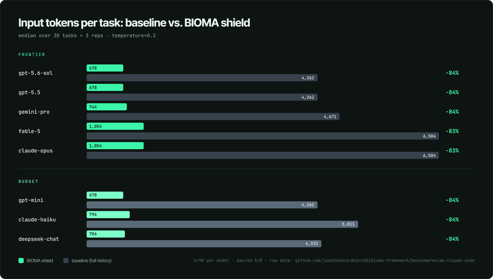
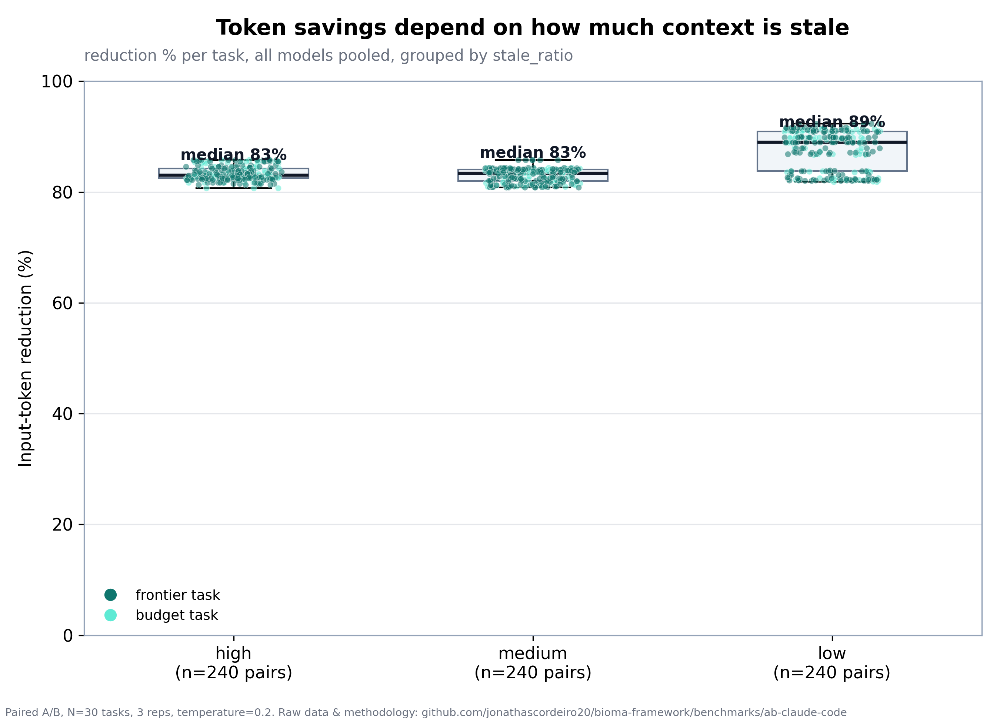
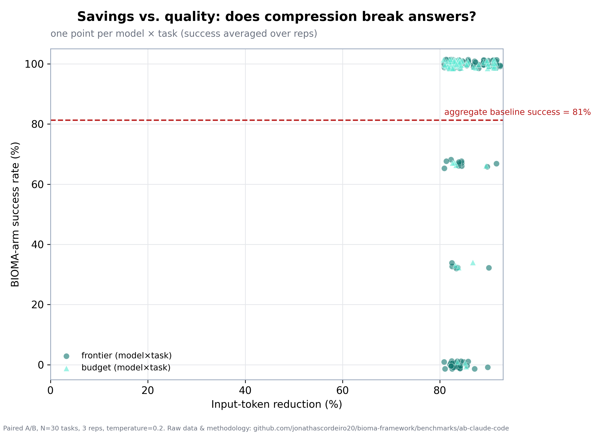
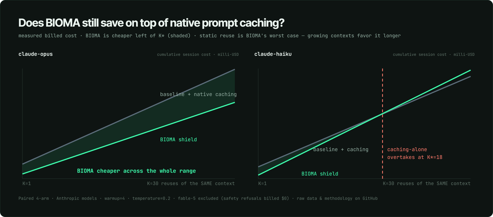
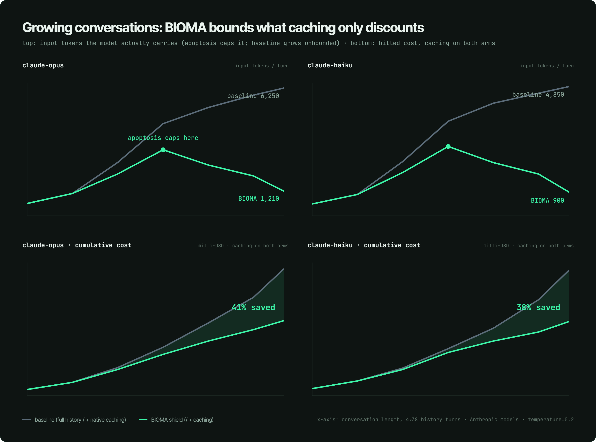
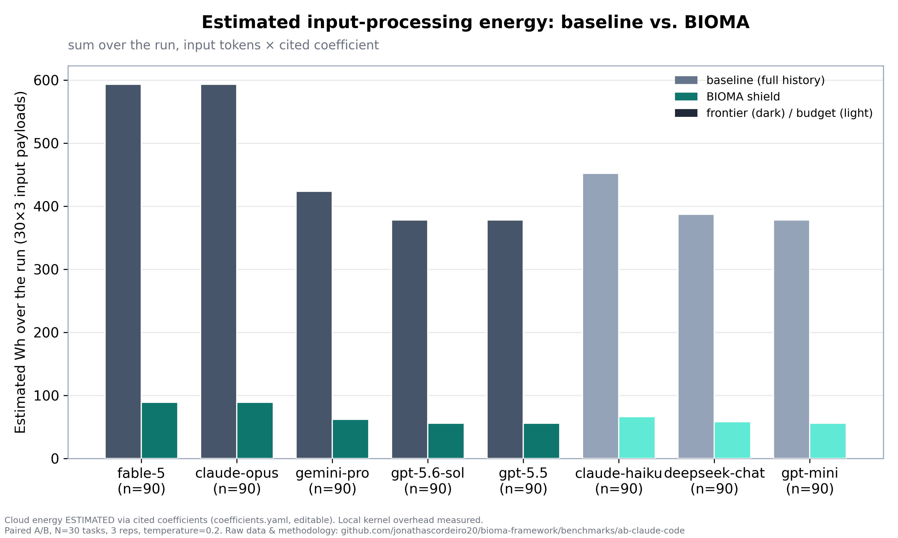

# Does client-side context pruning still matter when caching is free? A measured A/B.

**TL;DR** — We ran a paired A/B benchmark of B.I.O.M.A.'s context apoptosis
(client-side, deletion-only history pruning) against sending the full history,
across **8 models × 30 coding tasks × 3 reps = 1,440 real API calls**. Then we
re-ran the honest sceptic's question — *"native prompt caching already discounts
my history, so why bother?"* — as its own measured experiment. Every number
below comes from `results/results.jsonl` and the caching runs; nothing is
hand-tuned. Raw data, code, and this report live in
[benchmarks/ab-publico](https://github.com/jonathascordeiro20/bioma-framework/tree/main/benchmarks/ab-publico).

> **Revalidation note (2026-07-20, v1.3.1):** after the "purpose context" release
> (kernel 1.1.0: cache-aware `stable_prefix` + `consolidation_gain` + `effort_gauge`;
> gateway 1.3.1: opt-in `BIOMA_AUTO_EFFORT`), a paid pilot re-run of this A/B
> (4 models × 5 tasks, `rerun_v131.jsonl`) reproduced these results: median input
> reduction −82.2% (vs −83.8% here), **0 divergent pairs** on the executable gate,
> real billed cost −65%. Two new measurements were added: **−71% net cost AFTER
> the prompt-cache discount** (real `cache_control`) and **−89% reasoning tokens**
> from dynamic thinking budgets (−64% under a pytest quality gate, 0 divergent
> pairs). Full writeup: [`reports/BIOMA_REVALIDATION_V131.md`](../../../reports/BIOMA_REVALIDATION_V131.md).

Headline findings, all measured:

- **~84.7% median input-token reduction**, quality-neutral in aggregate
  (paired success 81.2% → 81.9%; −1 pt excluding one model's safety refusals).
- **BIOMA still saves ~42% on top of native prompt caching**, and on the
  flagship model (claude-opus) it is cheaper at **every** session length.
- In **growing conversations** BIOMA sends **5.2–5.5× fewer tokens** because
  apoptosis caps the context while the baseline grows unbounded.
- The savings are packaged as a **signed, tamper-evident carbon ledger** an
  auditor can verify without trusting us.

---

## 1. What was measured

Paired design: for every `(task, model, rep)` the same task runs twice — arm A
sends the full simulated session history; arm B sends
`CognitiveFirewall.shield(history, prompt, system)`. Same model, same query, so
each pair is directly comparable. 8 models across two tiers, 30 tasks spanning
three `stale_ratio` levels (how much of the history is obsolete), temperature
0.2, generation capped at 1024 tokens. **1,440 calls, 0 errors, 0 duplicates.**

> Honesty notes baked into the data, not hidden: (1) the run used
> **temperature=0.2**, not 0 — reported verbatim. (2) `claude-fable-5` refused
> 98/180 calls via a cyber-content safety classifier (a false positive on the
> agentic system prompt), and those refusals are billed **$0** — so fable-5 is
> excluded from cost comparisons and flagged everywhere.

## 2. The core result: big cut, quality held



Median input tokens per task drop ~84% uniformly across all 8 models and both
tiers. The reduction is exact (it's just token counting); the interesting part
is that **success held**:

| Model | Tier | N | Median reduction (95% CI) | Success baseline | Success BIOMA | $ saved / 1k sessions |
| :--- | :--- | ---: | :--- | ---: | ---: | ---: |
| gpt-5.6-sol | frontier | 90 | 84% [84, 84] | 91% | 89% | $20 |
| gpt-5.5 | frontier | 90 | 84% [84, 84] | 86% | 86% | $20 |
| gemini-pro | frontier | 90 | 84% [83, 84] | 63% | 60% | $9 |
| fable-5 | frontier | 90 | 83% [83, 84] | 33% | 47% | $62 |
| claude-opus | frontier | 90 | 83% [83, 84] | 97% | 96% | $31 |
| gpt-mini | budget | 90 | 84% [84, 84] | 97% | 99% | $3 |
| claude-haiku | budget | 90 | 84% [83, 84] | 97% | 97% | $5 |
| deepseek-chat | budget | 90 | 84% [83, 84] | 87% | 83% | $1 |

Wilcoxon signed-rank p ≈ 1.7e-16 for every model. `$ saved / 1k sessions` is a
linear extrapolation of the measured mean input-token saving × list input price.

### The chart that stops an inflated headline



This one exists to be honest: the savings depend on how much of the context is
stale. Even so, the reduction is 83–89% across all three levels — and, contrary
to our prior suspicion, low-stale (where most context is relevant) held its
success rate (85% → 86%). The small quality dip is in medium-stale, not low.

### Savings don't buy broken answers



One point per model×task: high reduction with mostly-intact success. The low
outliers are fable-5's refusals and gemini-pro — shown, not hidden.

## 3. The sceptic's question: does this beat free caching?

Native prompt caching (Anthropic, OpenAI, …) already discounts a stable prefix
to ~0.10× on a warm hit. So we ran a **4-arm** experiment — baseline/BIOMA ×
cache-off/cache-on — on Anthropic models (opt-in `cache_control`, so cache-off
is a true control), reusing each context R times and summing the **real billed
cost** (which reflects caching).



- **BIOMA is median 42% cheaper than baseline+caching** per 4-reuse session.
- **claude-opus**: the shielded payload is small *and* still cacheable, so BIOMA
  is cheaper at **every** session length (9/12 tasks never cross).
- **claude-haiku**: the shielded payload (~1k tokens) is below the ~4–6k-token
  cacheable minimum, so it can't cache — native caching on the big baseline
  overtakes after **~15 reuses of the identical context**. Left of that, BIOMA
  wins. (Static reuse is BIOMA's worst case.)

### Growing conversations — where BIOMA pulls away

Real sessions grow: each turn appends history. Caching discounts the prefix, but
the model still **carries** the whole growing context. Apoptosis deletes stale
turns and keeps it bounded.



Top: the baseline grows unbounded to ~5–6k tokens/turn while BIOMA's curve peaks
and then **bends back down** to ~0.9–1.2k as older context decays — **5.2–5.5×
fewer tokens carried**. Bottom: ~38–41% cumulative cost saved even with caching
on both arms. (Honest caveat: our task histories cap at 36–50 turns, so the last
1–2 steps plateau into a cached read, narrowing the $ gap there. The token
divergence is the clean, coefficient-free signal — and it drives latency, context
-window pressure, and decode energy, which caching does not neutralize.)

## 4. Energy — and a signed ledger you can verify



Tokens are measured; cloud energy is **estimated** with declared, versioned
literature coefficients (`coefficients.yaml`, editable) — always low/mid/high,
never one unqualified number. The reduction % is coefficient-independent.

Because a carbon or cost claim is only worth anything if a third party can check
it, the savings ship as an **auditable ledger**:

```bash
bioma-carbon-ledger keygen --out issuer
bioma-carbon-ledger build bioma_gateway_audit.jsonl --grid br --price-in 2.0 \
    --key issuer.key --out ledger.json
bioma-carbon-ledger verify ledger.json --pub issuer.pub --audit bioma_gateway_audit.jsonl
```

Run over the 720 measured pairs from this benchmark it reports **3,982,365 →
591,865 input tokens (−85.1%), 1,695 / 3,051 / 4,408 Wh avoided, $6.78 input
cost avoided**, then Ed25519-signs the result over a hash-chained audit. `verify`
catches both attacks — forging the signed number → `signature INVALID`;
tampering the audit → `recompute MISMATCH`. Avoided emissions are a
**counterfactual**, reported separately (GHG Protocol — never netted against
Scope 1/2/3, never an offset).

## 5. Honest limitations

- **Synthetic-ish histories.** Tasks use simulated dev-session history with
  controlled staleness, not production traces. Real redundancy varies; the
  stale-ratio chart is there so you can locate your own workload.
- **Caching crossover is real.** If your context is perfectly static and reused
  dozens of times, native caching alone is competitive on budget models. BIOMA's
  edge is growing/agentic contexts and cache-miss traffic.
- **Energy is estimated.** The Wh/CO2e figures inherit the coefficient's
  uncertainty (bounds shown); a measured-GPU harness is the next step. Tokens
  and billed $ are ground truth.
- **List prices vs router fees.** `$ saved` uses `models.yaml` list prices; real
  billed cost (captured per call) is used wherever we report dollars measured.

## 6. Reproduce

```bash
pip install -e ../..                      # bioma-framework
python run_benchmark.py --tier budget   --reps 3 --via-openrouter
python run_benchmark.py --tier frontier --reps 3 --via-openrouter
python analyze.py            # main A/B
python run_benchmark_cached.py  && python analyze_cached.py    # caching, static reuse
python run_benchmark_growing.py && python analyze_growing.py   # caching, growing chat
python results/make_charts.py                                  # all figures
```

Everything here — the runner, the analyzer, the 1,440-row dataset, the caching
runs, the charts, and the ledger — is in the repo.
